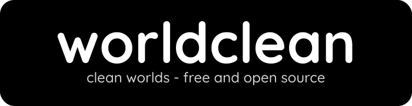

# 

### About
worldclean is a free and open source command line utility
used to clean ANVIL format worlds for public consumption.
The idea behind this utility is to make it so that worlds are
completely still and preserved in its original state.

### Goals
* Easily adjust settings using command line flags
* Prune unused chunks
* Strip and remove unnecessary metadata
* Adjust game rules to keep worlds from being dirtied
